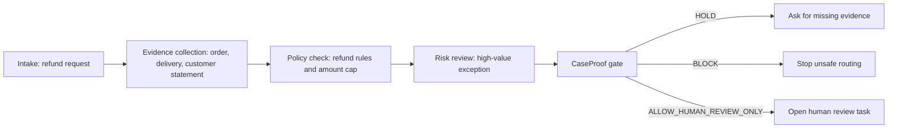

# Maestro Case Flow

Scenario: high-value refund exception.

CaseProof is not the approval step.

It only asks whether the case packet is complete enough for a person to review.

It does not issue a refund, settle a claim, update a customer record, or close a case.

